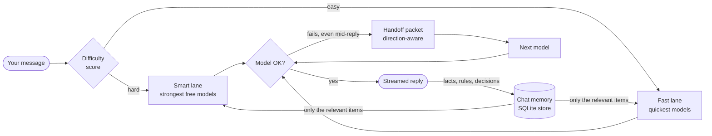

<div align="center">

# ContextOS

**Your AI conversation keeps its memory, even when the model changes.**

A local chat app, context engine and build agent that runs on free AI models. It sends hard questions to the strongest free model and easy ones to the fastest. When a model fails mid-answer, another one continues from the same memory. And in **Build mode** it researches, plans, builds and tests a whole project, feature by feature.

[](https://www.python.org/downloads/)
[](requirements.txt)
[](https://github.com/nilanshpratapanand/Context-Manager-Context-OS/releases/latest)
[](tests/test_contextos.py)
[](docs/CONFIGURATION.md)
[](LICENSE)

[Install](#install) · [Features](#features) · [Build mode](#build-mode) · [How it works](#how-it-works) · [Free API keys](#get-free-api-keys) · [Docs](#documentation)

</div>

---

## Why ContextOS

Free AI models run out: rate limits, busy servers, daily quotas. When that happens mid-task, you usually have to start over in a new tool and explain everything again.

ContextOS keeps the **memory of a conversation in your own app, not inside a model**. Every reply saves the facts, rules and decisions it established to a small local database. Whichever model answers next gets only the relevant parts of that memory, so the model can change and the task carries on.

> **The transcript is for display. The store is the memory.**

## Features

| | |
|---|---|
| **Chat app** | A normal chat interface in your browser: saved conversations, search, rename, delete, light and dark themes, and a phone layout. |
| **Streaming** | Replies appear word by word, with a Stop button. Models that reason show a collapsible *Thinking…* section. |
| **Rich messages** | Markdown, tables, code blocks with Copy and syntax highlighting, maths via KaTeX. Copy, Regenerate and Edit on messages. |
| **Smart / fast routing** | Each message is scored for difficulty with no API call spent on it. Hard ones go to the strongest free models, easy ones to the fastest. You can override it with `/smart` or `/fast`. |
| **Automatic handoff** | If a model fails, even halfway through a reply, the next one takes over with a compact, direction-aware summary of the memory. |
| **Memory panel** | See exactly what the model remembers about a chat, and delete anything wrong. |
| **Continue in another AI** | Export a chat's memory as one Markdown message and paste it into ChatGPT, Claude, Gemini or any other AI. |
| **Build mode** | Give it a goal and it researches (web, docs, arXiv papers), plans features, then builds them one at a time, **running each feature's tests before moving on**. Then a security review and a report. See [Build mode](#build-mode). |
| **Connectors (MCP)** | Connect any MCP server via `mcp.json` (the same format as Claude Desktop). Its tools become available to builds. |
| **Skills** | Reusable instructions in the open `SKILL.md` format. Three are bundled; add your own. |
| **Key setup in the app** | Sign up with each provider, paste your key, test it and save it. `.env` is written for you and models reload without a restart. |
| **7 free providers** | Groq, Google Gemini, OpenRouter, NVIDIA, Cloudflare, Mistral and Cohere, plus Ollama for offline use. None of them need a credit card. |
| **Zero dependencies** | Pure Python standard library and SQLite, with no build step. The installer sets everything up. |

## Install

### Windows 10 / 11

Download **[`install.bat`](https://github.com/nilanshpratapanand/Context-Manager-Context-OS/releases/latest/download/install.bat)** from the [latest release](https://github.com/nilanshpratapanand/Context-Manager-Context-OS/releases/latest) and double-click it. Or paste this into PowerShell:

```powershell
irm https://raw.githubusercontent.com/nilanshpratapanand/Context-Manager-Context-OS/main/install.bat -OutFile install.bat; .\install.bat
```

### macOS / Linux

```bash
curl -fsSL https://raw.githubusercontent.com/nilanshpratapanand/Context-Manager-Context-OS/main/install.sh | bash
```

### What the installer does

| Step | Windows (`install.bat`) | macOS / Linux (`install.sh`) |
|---|---|---|
| 1. Python 3.9+ | Finds it, or offers to install it with `winget` | Finds it, or offers to install it with Homebrew / apt / dnf / pacman / zypper |
| 2. Download | `git clone` if Git is installed, otherwise the GitHub zip | `git clone`, otherwise the tarball via curl or wget |
| 3. Environment | Private `.venv` + `pip install -r requirements.txt` | Same |
| 4. Settings | Creates `.env` from `.env.example` | Same |
| 5. Self-test | Runs the 103 tests | Same |
| 6. Finish | Desktop shortcut, opens `.env` in Notepad, starts the app | Offers to start the app |

It installs to `%USERPROFILE%\ContextOS` or `~/ContextOS`. **Run it again to update**: your `.env` keys and your chats are never touched.

| Option | Windows | macOS / Linux |
|---|---|---|
| Accept all defaults, no prompts | `install.bat /y` | `bash install.sh -y` |
| Install elsewhere | `install.bat /dir "D:\Apps\ContextOS"` | `bash install.sh --dir ~/apps/contextos` |
| Don't start the app at the end | `install.bat /nolaunch` | `bash install.sh --no-launch` |
| Install from a fork | `set CONTEXTOS_REPO=<git url>` | `CONTEXTOS_REPO=<git url> bash install.sh` |

<details>
<summary><b>Manual install</b></summary>

```bash
git clone https://github.com/nilanshpratapanand/Context-Manager-Context-OS.git ContextOS
cd ContextOS
python -m venv .venv
.venv/bin/python -m pip install -r requirements.txt     # Windows: .venv\Scripts\python
cp .env.example .env                                     # Windows: copy .env.example .env
python -m contextos.server
```

On Windows, use `py` instead of `python` if `python` isn't found.
`requirements.txt` holds only one optional package (`tiktoken`, for exact token counts), so you can skip the `pip` step entirely.

</details>

### Start it

| | Windows | macOS / Linux |
|---|---|---|
| Chat with real models | Double-click `RUN.bat` → **1** | `./run.sh` |
| Try it with no API keys | `RUN.bat` → **2** | `./run.sh --offline` |
| Check which keys work | `RUN.bat` → **T** | `./run.sh check` |
| Run the tests | `RUN.bat` → **5** | `./run.sh test` |

The chat opens at **http://127.0.0.1:8000**.

## Get free API keys

You need a key from **at least one** provider. Two or three make the fallback useful. All of these are free with no credit card.

**Easiest: do it in the app.** Click the **key icon** (bottom left) or **Set up free models** on the welcome screen. Each provider card links to its signup page, lists the steps, and has **Test** and **Save** buttons. Saving writes `.env` for you, and the models work straight away with no restart. Saved keys are never shown again, only their last four characters. You can also edit `.env` by hand.

| Provider | Get a key | Why use it |
|---|---|---|
| **Groq** | [console.groq.com/keys](https://console.groq.com/keys) | Fastest, with about 1 s replies. The best first pick. |
| **OpenRouter** | [openrouter.ai/settings/keys](https://openrouter.ai/settings/keys) | One key for 20 free models. |
| **Cloudflare Workers AI** | [dash.cloudflare.com/profile/api-tokens](https://dash.cloudflare.com/profile/api-tokens) | Generous daily allowance. Also needs your account ID. |
| **Google AI Studio** | [aistudio.google.com/app/apikey](https://aistudio.google.com/app/apikey) | Strong Gemini Flash models, which are often busy at peak hours. |
| **NVIDIA** | [build.nvidia.com](https://build.nvidia.com/) | 80+ open models. Correct but slow, so it's used as a late fallback. |
| **Cohere** | [dashboard.cohere.com/api-keys](https://dashboard.cohere.com/api-keys) | 1,000 calls a month, for non-commercial use. |
| **Mistral** | [console.mistral.ai/api-keys](https://console.mistral.ai/api-keys) | Free plan, often rate-limited. |
| **Ollama** | [ollama.com/download](https://ollama.com/download) | Runs on your own computer: no key, no limits, works offline. |

Which model each provider uses, and every setting you can change, is in **[docs/CONFIGURATION.md](docs/CONFIGURATION.md)**.

## Using the chat

- **Pick a lane:** *Auto / Smart / Fast* in the top bar, or start a message with `/smart` or `/fast`. The model picker says which model to try first.
- **See why a model was chosen:** the ⓘ button under a reply shows the model, the difficulty score, the context tokens sent, any handoffs, and the facts saved.
- **Memory:** the brain button shows this chat's saved facts. Delete anything wrong. Regenerate and Edit automatically undo the facts saved by the reply they replace.
- **Continue in another AI:** the share button creates a paste-ready Markdown summary.
  - *Compact* stays under 5,000 characters, so ChatGPT keeps it inline instead of turning it into an attachment.
  - *Standard* adds more memory and the last three exchanges.
  - *Full* adds the whole transcript and is meant to be downloaded as a `.md` file.
- **Models:** the bottom-left panel shows every model's status. Click one to simulate it failing and watch the handoff.

| Shortcut | Action |
|---|---|
| <kbd>Enter</kbd> / <kbd>Shift</kbd>+<kbd>Enter</kbd> | Send / new line |
| <kbd>Esc</kbd> | Stop the reply |
| <kbd>Ctrl</kbd>+<kbd>K</kbd> | Search chats |
| <kbd>Ctrl</kbd>+<kbd>Shift</kbd>+<kbd>O</kbd> | New chat |

## Build mode

Click **New build**, describe what you want, and pick a folder. Or from a terminal:

```bash
python -m contextos.build "A CLI word counter with a --top N option" --workspace ./wordcount
```

| Phase | What happens | Models |
|---|---|---|
| Research | Web search, docs, Wikipedia and arXiv papers; findings saved with sources | Fast |
| Plan | Features, each with its own test command | Smart |
| **You** | Approve or edit the plan | — |
| Build | Code + tests per feature. **ContextOS runs the tests itself**, and gives the agent the real error and up to 2 retries if they fail. Earlier tests rerun after every feature. | Smart |
| Security | Vulnerability scan, then a model review and fixes, then tests again | Smart |
| Report | `BUILD_REPORT.md`, written from real test results | — |

**Getting your project:** use **Download .zip**, **Open folder**, or **Preview site ↗**
(web projects run sandboxed) on the build page. **Changing it:** type a request in the
box under any finished build. ContextOS makes the change, updates the tests, runs them
all and logs the change in the report.

**Safety:** the agent can only touch the project folder, and `.git`, `.env` and key
files are off-limits. Commands ask you first, except the plan's own test commands when
they are plainly a test runner. Commands run without your API keys, web pages can't reach
your local network, and web content is never treated as instructions. Everything is in
**[docs/AGENT.md](docs/AGENT.md)**, including connectors, skills and the API.

## How it works



1. **Route.** A deterministic score looks for code, multi-step maths, design and debugging words, message length and several questions. A score of 0.5 or more goes to the smart lane.
2. **Select.** Only the memory items relevant to this message are sent, found by combining four rankers: address match, BM25 text search, intent, and importance/recency. The whole history is never sent.
3. **Stream.** The reply streams from the first available model in the lane. A model that fails is rested for a while (60 s for a rate limit, 30 s when busy, an hour if retired or paywalled), so later messages skip it.
4. **Hand off.** If a model fails, ContextOS builds a packet shaped by the direction of the switch (stronger, weaker or equal model), lists anything it left out, and continues on the next model.
5. **Save.** Each reply starts with a hidden block of the facts, rules and decisions it established. ContextOS saves them to the chat's memory, and the user never sees the block.

## Results

On the built-in benchmark (`python -m contextos.bench`), which measures whether the next model receives every fact the rest of the task depends on:

| Strategy | Sufficiency | Tokens sent |
|---|---|---|
| Replay the full history | 38.9% | 1,614 |
| Summarise the history | 75.0% | 1,422 |
| **ContextOS** | **100.0%** | **464** |

That's full sufficiency at about a third of the tokens of the best baseline. The research behind the design, the full benchmark and its limits are in **[docs/RESEARCH.md](docs/RESEARCH.md)**.

## Project structure

```
ContextOS/
├── install.bat / install.sh    one-file installers
├── RUN.bat / run.sh            launchers
├── requirements.txt            optional extras only
├── .env.example                every free provider, with signup links
├── contextos/
│   ├── server.py               chat engine + HTTP API: streaming, handoffs, per-chat memory
│   ├── dashboard.html          the chat UI (one file, no build step)
│   ├── chats.py                saved conversations
│   ├── router.py               smart / fast lanes, difficulty score, cooldowns
│   ├── live.py                 providers, streaming, model checks
│   ├── builder.py / build.py   build mode pipeline and its terminal command
│   ├── agent.py                the step-by-step agent loop
│   ├── tools.py                agent tools: files, commands, web, papers, security scan
│   ├── mcp_client.py           MCP connectors
│   ├── skills.py, skills/      Agent Skills (SKILL.md) and the bundled ones
│   ├── store.py                SQLite + full-text search, versioning, conflicts
│   ├── retrieval.py            four-ranker hybrid search
│   ├── budget.py / handoff.py  token-budget packing, handoff packets
│   ├── mcp_server.py / cli.py  MCP server and command line
│   └── bench.py / demo.py      benchmark and demo
├── tests/                      103 tests, standard library only
└── docs/                       configuration, API, research
```

## Requirements

- **Python 3.9 or newer.** Developed and tested on 3.12 and 3.14. The installers set it up for you.
- **Windows 10/11, macOS or Linux.**
- **No third-party packages.** `requirements.txt` lists only `tiktoken` (optional, for exact token counts).
- **At least one free API key**, or Ollama, or `--offline` to try it with simulated replies.
- **Internet**, for the models. Code highlighting and maths formatting also load from a CDN; without it they show as plain text and everything else works.

## Troubleshooting

| Problem | Fix |
|---|---|
| *Python was not found* | Rerun the installer and accept the Python install, or get it from [python.org](https://www.python.org/downloads/) with **Add to PATH** ticked. |
| *No providers available* | Add at least one key to `.env`, then restart. |
| A model shows *resting* or *HTTP 429 / 503* | That provider is busy or rate-limited. ContextOS already switched to the next one. It comes back on its own. |
| *model not found (404)* | Free models get retired. Run `RUN.bat` → **M** (or `python -m contextos.live --models`) and set a new one in `.env`, e.g. `GROQ_MODEL=...`. |
| Port 8000 is already in use | `python -m contextos.server --port 8080` |
| `ensurepip`/`venv` error on Ubuntu | `sudo apt install python3-venv`, then rerun `install.sh`. |

## Documentation

| | |
|---|---|
| [docs/AGENT.md](docs/AGENT.md) | Build mode: phases, tools, safety model, MCP connectors, skills, CLI |
| [docs/CONFIGURATION.md](docs/CONFIGURATION.md) | Providers, models, `.env` settings, routing, server options, where data is stored |
| [docs/API.md](docs/API.md) | HTTP API, streaming events, Python library, CLI, MCP server |
| [docs/RESEARCH.md](docs/RESEARCH.md) | The research, design decisions, benchmark, live evaluation, limits |
| [PLAN.md](PLAN.md) | The original research plan behind each decision |

## Privacy and security

- Everything runs on your computer. Chats and memory are stored in `chat_data/`, and messages go only to the model providers you add keys for.
- API keys stay in `.env`, which git ignores. They are never logged or sent to the browser.
- The server listens on `127.0.0.1` only. It checks the `Host` and `Origin` headers and requires JSON, so other websites can't use your keys through it.

## Limitations

- Retrieval is lexical: a question that shares no words with a saved fact may not find it.
- Free tiers change often. Models get retired and limits move, so run `RUN.bat` → **T** when something stops working.
- ContextOS carries declared state (facts, rules, decisions), not a model's unfinished reasoning.
- Build mode on free tiers is slow: about 3–4k tokens a step against limits of a few
  thousand tokens a minute, so a 4-feature build can take 10–30 minutes. More keys help.
- `install.sh`'s package-manager and `venv` branches for macOS and Linux haven't been run on those systems yet. The shared steps are tested.

## License

[MIT](LICENSE) © 2026 Nilansh Pratap
